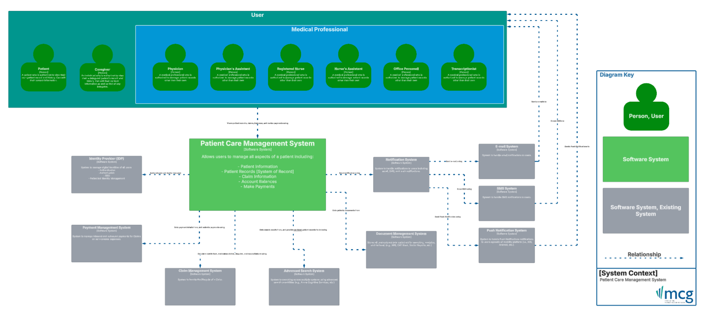
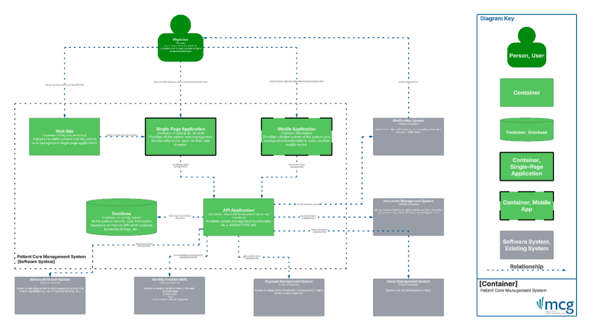
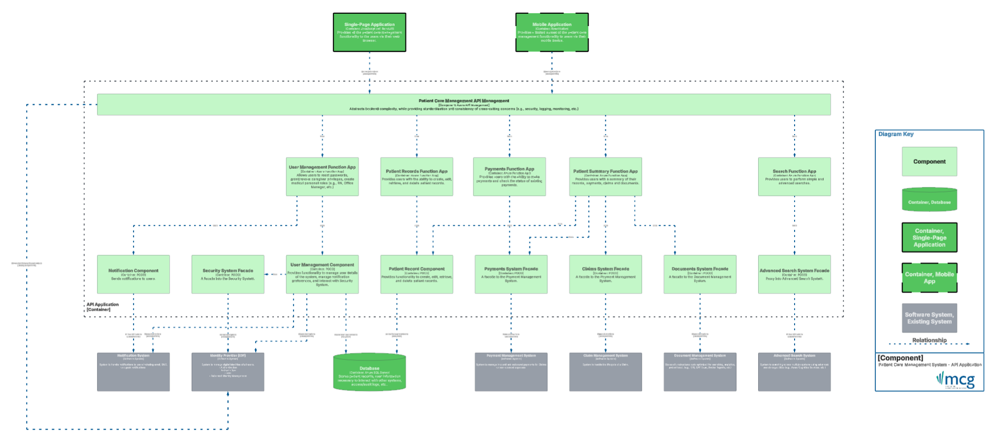

# Patient Care Management System (PCMS)

## MCG Staff Software Engineer Take Home Assessment

### Applicant
- Josh Hawthorne
- E: joshhawthorne@gmail.com
- M: 405.413.4995

## Requirements
[MCG Software Engineer Take Home Assessment](Docs/MCG_Software_Engineer_Take_Home_Assessment.pdf)

## RAID Log (Risks, Assumptions, Issues, and Decisions)
[RAID Log (Excel)](Docs/MCG_RAID_Log.xlsx)

## Design

### Approach Used
[The C4 model for visual software architecture](https://c4model.com/)
[Lucidchart](https://www.lucidchart.com/)

### System Context Diagram [PCMS]

[Lucidchart](https://lucid.app/lucidchart/6874c0da-aa48-4532-ad36-db17ec0db28e/edit?viewport_loc=-6812%2C-587%2C14038%2C7094%2C0_0&invitationId=inv_5bc533e5-c055-4023-aac0-47b0ec8ebbd1) | [PDF](Docs/SystemContextDiagram.pdf)

### Container Diagram [PCMS]

[Lucidchart](https://lucid.app/lucidchart/6874c0da-aa48-4532-ad36-db17ec0db28e/edit?viewport_loc=-2385%2C-727%2C10367%2C5220%2CvagVQKk2QECb&invitationId=inv_5bc533e5-c055-4023-aac0-47b0ec8ebbd1) | [PDF](Docs/ContainerDiagram.pdf)

### Component Diagram [PCMS - API Application]

[Lucidchart](https://lucid.app/lucidchart/6874c0da-aa48-4532-ad36-db17ec0db28e/edit?viewport_loc=-6153%2C74%2C10367%2C5220%2ClojVe~xXzPnl&invitationId=inv_5bc533e5-c055-4023-aac0-47b0ec8ebbd1) | [PDF](Docs/ComponentDiagram.pdf)